# AWS Route 53 Console Clone

A functional clone of the **AWS Route 53 console** — hosted zone and DNS record management with the Route 53 look, navigation and workflows — backed by a real REST API and a persistent SQLite database.

It does **not** run DNS. It recreates the console experience and Route 53's data model and rules (default SOA/NS records, CNAME restrictions, "zone must be empty before delete", record-value formats).

| | |
|---|---|
| **Frontend** | Next.js 15 (App Router) · TypeScript · [Cloudscape Design System](https://cloudscape.design) |
| **Backend** | FastAPI · Pydantic v2 · SQLAlchemy 2.0 |
| **Database** | SQLite |
| **Demo login** | Account ID `123456789012` · administrator `demo` / `demo1234` · read-only `viewer` / `viewer1234` |
| **Live demo** | **https://route53-clone-gilt-seven.vercel.app** · API docs: https://route53-clone-api-9vm3.onrender.com/docs (free tier: the first request after a quiet period can take ~50 s while the API wakes up) |

## Walkthrough video

[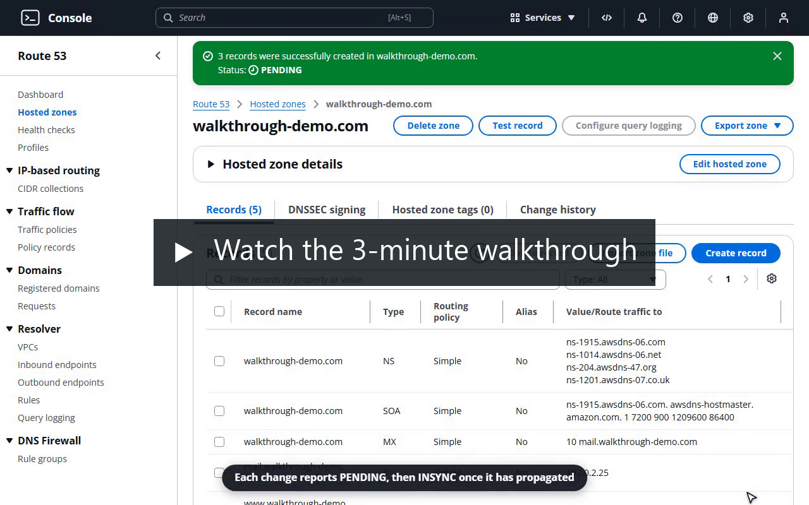](docs/walkthrough.mp4)

A 3-minute tour of the console: sign-in, hosted zones, creating records in one batch with their change status, searching and editing records, Test record, change history, concurrent-edit protection, shareable URLs, keyboard shortcuts and the read-only IAM user. ([MP4, 5.5 MB](docs/walkthrough.mp4))

## Screenshots

| Hosted zones | Records + details panel |
|---|---|
| 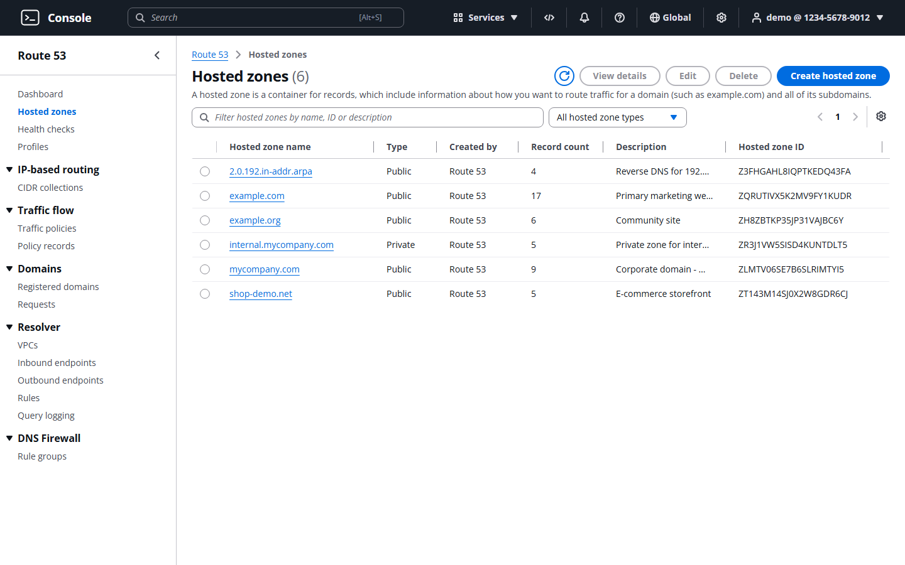 | 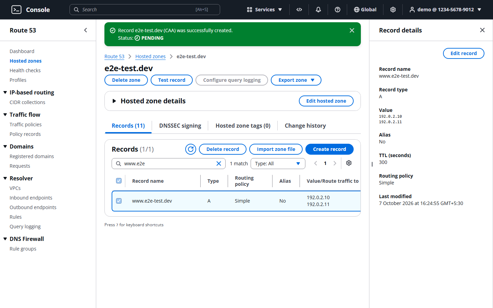 |
| **Create record** | **Dark mode** |
| 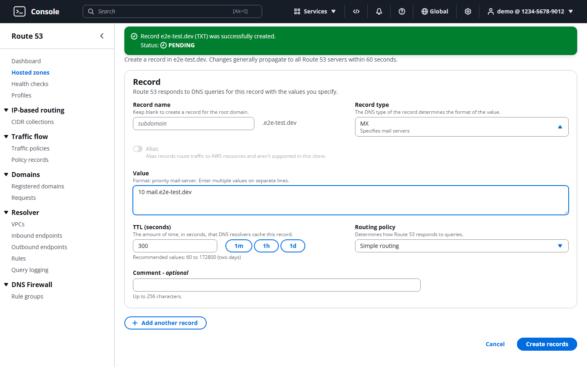 | 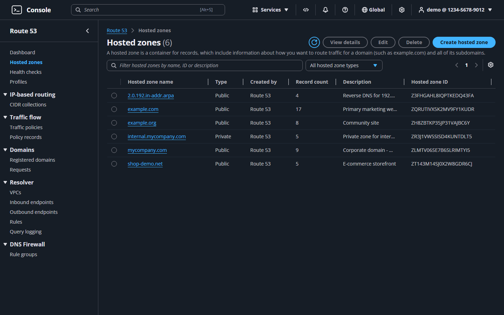 |
| **Test record** | **Change history** |
| 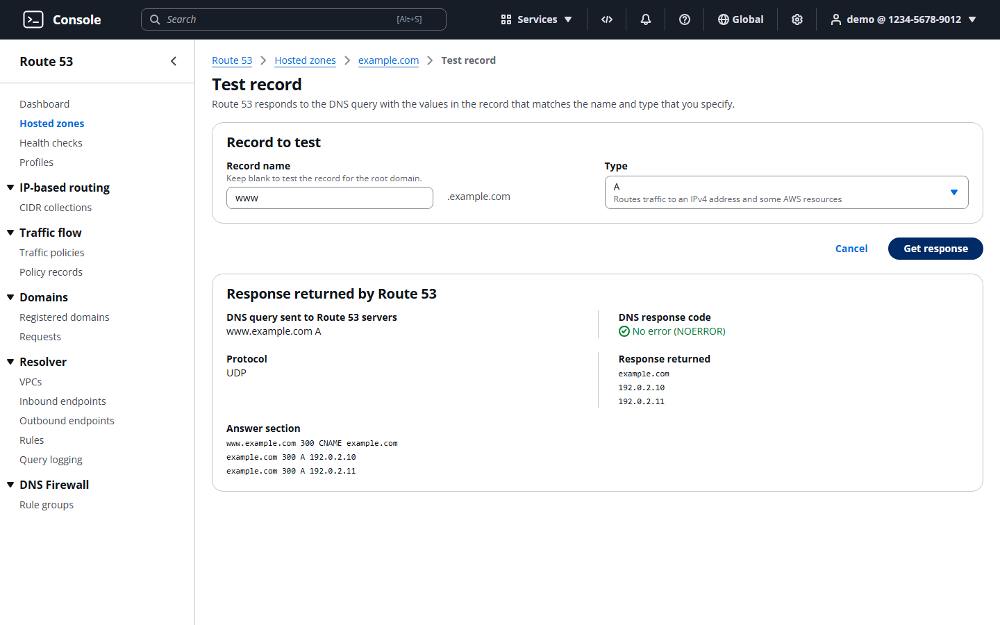 | 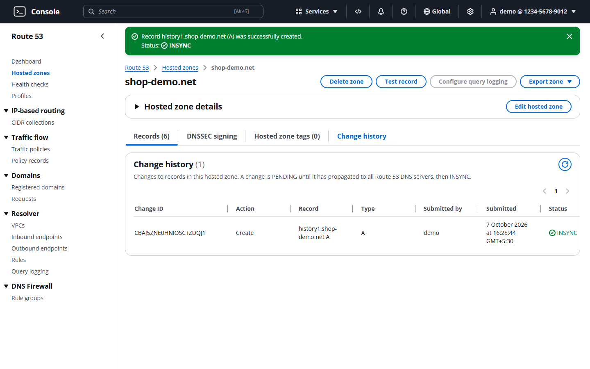 |
| **Read-only IAM user** | **Keyboard shortcuts** |
| 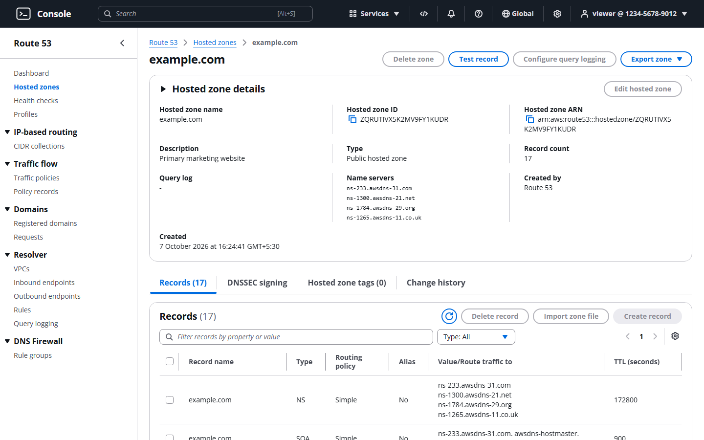 | 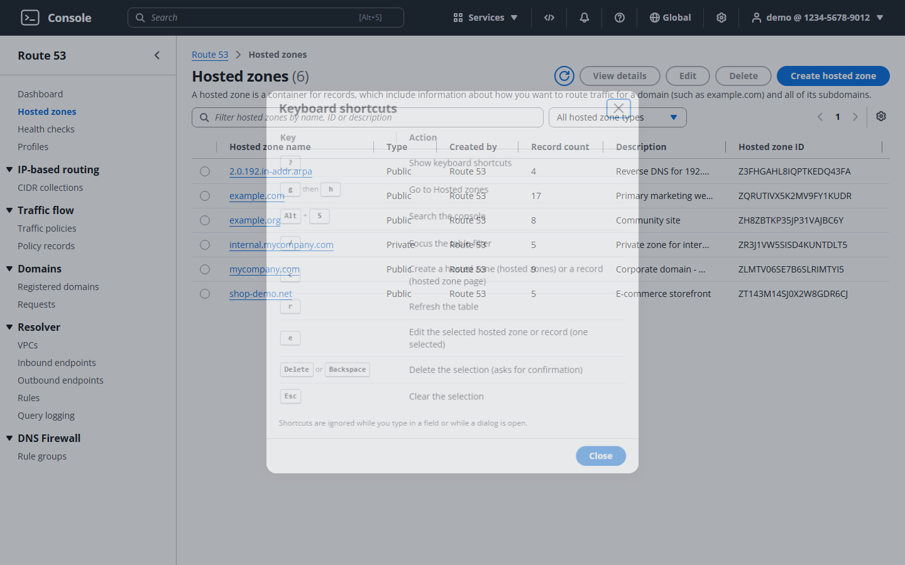 |

All 22 screenshots are in [`docs/screenshots/`](docs/screenshots).

---

## Features

**Authentication (mocked)**
- AWS-style "Sign in as IAM user" page (account ID, username, password) with a working "Remember this account"
- Opaque bearer-token sessions stored in SQLite; session survives page refresh
- All console routes and API endpoints are protected; an expired/revoked session redirects to sign-in
- Sign out from the account menu (server-side session is deleted)
- **Two mock IAM users**: `demo` (administrator) and `viewer` (read-only). The read-only user can browse, search, export and use Test record, but every create, edit, delete and import button is disabled with an explanation, and the API answers those requests with `403 AccessDenied` in AWS's wording (`User: arn:aws:iam::<account>:user/<name> is not authorized to perform: route53:<Action> on resource: arn:aws:route53:::hostedzone/<id>`)
- Account menu shows the user's role and links to mocked Account, Organization, Service Quotas, Billing and Cost Management and Security credentials pages

**Hosted zones**
- Table with Route 53's columns: name, type, created by, record count, description, hosted zone ID
- Server-side search (name, ID or description), type filter (public/private), pagination
- Preferences: page size and visible columns (visible columns are remembered per browser)
- Create page with public/private tiles (private zones take a VPC region + VPC ID)
- Every new zone automatically gets apex **NS** (4 name servers) and **SOA** records, like Route 53
- Several zones may share a name, as in Route 53 (each has its own ID and name servers); only a private zone whose VPC already has a private zone of that name is rejected (`409 ConflictingDomainExists`)
- Edit description (Route 53 only allows changing the description)
- Delete with type-`delete`-to-confirm modal; blocked while the zone has records other than its default NS/SOA (Route 53's `HostedZoneNotEmpty` rule)
- Detail page: collapsible "Hosted zone details", name servers, copy-able zone ID and ARN (`arn:aws:route53:::hostedzone/<id>`), tabs
- **Test record** (Route 53's DNS response simulator): shows the response code, answer and authority sections Route 53 would return, following delegations, CNAME chains (loop and 8-hop protection) and wildcards

**DNS records** — `A, AAAA, CAA, CNAME, MX, NS, PTR, SRV, TXT` (+ the default SOA)
- Records table with Route 53's columns (name, type, routing policy, differentiator, alias, value, TTL …)
- Server-side search by name **or value**, type filter, pagination, column/page-size preferences (columns remembered per browser)
- Safe concurrent edits: if someone else saved the record after you opened it, saving shows a conflict with **Reload latest** instead of overwriting their change
- Multi-select; selecting one record opens the **Record details split panel** (with *Edit record*, as in Route 53)
- Create / edit pages modelled on Route 53's "Quick create record": name with zone suffix, type selector with descriptions, multi-line values, TTL with 1m/1h/1d presets, and **Add another record** to create several records in one atomic batch
- Type-aware validation on both client and server (IPv4/IPv6, hostnames, `priority host` for MX, `priority weight port target` for SRV, `flags tag "value"` for CAA, quoted TXT strings ≤255 chars); host names in CNAME, NS, PTR, MX and SRV values are stored lowercase without the trailing dot
- Route 53 rules: no duplicate name+type, CNAME can't coexist with other records or sit at the apex, apex SOA/NS can't be deleted or retyped
- Delete one or many records with a confirmation modal

**Console experience**
- AWS console top bar: Services menu, console search (**Alt+S**; finds features and hosted zones), CloudShell / notifications / help / region / settings / account menus
- Route 53 side navigation (all sections), breadcrumbs
- Flashbar notifications for every create/update/delete/sign-in/sign-out and for errors
- **Change status**: record changes report `Status: PENDING` in their notification and switch to `INSYNC` once the change has "propagated" (polled from `GET /api/changes/{id}`, like Route 53 GetChange)
- **Change history** tab on each hosted zone: every record create, update, delete and import with who submitted it, when, and its status
- **Shareable views**: search, type filter, page and page size of the hosted zone list and the records table live in the URL (`?search=&type=&page=&pageSize=`), so refresh, shared links and the back button restore the same view, and Create/Edit record return to it on Save or Cancel. Invalid values fall back to the defaults.
- Loading, empty, no-match and error states (with retry) everywhere
- Responsive down to phone width
- Mocked sections (Dashboard, Health checks, Profiles, Traffic policies, Resolver, …) show a "Coming soon" page

**Bonus features**
- ✅ Import records from a **BIND zone file** (paste or upload; handles `$ORIGIN` (absolute or relative), `$TTL`, TTLs in seconds or BIND units such as `1h`, `1d` or `1h30m`, `@`, relative names, multi-line SOA, comments; malformed lines are reported per line and the rest is imported)
- ✅ Export a hosted zone as **BIND** or **JSON** (Route 53 API-shaped)
- ✅ **Dark mode** (Settings menu in the top bar, remembered per browser)
- ✅ **Keyboard shortcuts** (press `?` or *Settings → Keyboard shortcuts* for the list):

  | Key | Action |
  |---|---|
  | `?` | Show keyboard shortcuts |
  | `g` then `h` | Go to Hosted zones |
  | `Alt`+`S` | Search the console |
  | `/` | Focus the table filter |
  | `c` | Create a hosted zone (hosted zones list) or a record (hosted zone page) |
  | `r` | Refresh the table |
  | `e` | Edit the selected hosted zone or record (exactly one selected) |
  | `Delete` / `Backspace` | Delete the selection (opens the confirmation) |
  | `Esc` | Clear the selection |

  Shortcuts are ignored while typing in a text field, while a dialog is open, or when Ctrl/Meta/Alt is held, and write shortcuts do nothing for the read-only user.
- ✅ **Bulk operations**: multi-select delete of records

---

## Architecture

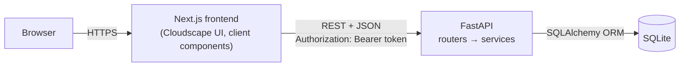

```
Browser ──▶ Next.js (React, TypeScript, Cloudscape) ──▶ FastAPI REST API ──▶ SQLite
```

**Frontend** (`frontend/`)
```
app/
  login/                         Sign-in page
  (console)/layout.tsx           Auth guard + console shell for every console page
  (console)/hosted-zones/        List, create, detail
  (console)/hosted-zones/[zoneId]/records/create | [recordId]/edit
  (console)/[...section]/        "Coming soon" catch-all for mocked sections
components/
  layout/        ConsoleShell (TopNavigation + AppLayout + SideNavigation + Flashbar + SplitPanel)
  providers/     AuthProvider (session), NotificationsProvider (flashbar)
  hosted-zones/  Edit / delete modals
  records/       RecordsTable, RecordForm, details panel, delete + import modals
hooks/           useApiQuery (fetching, stale-response protection), useFollow (client-side links)
lib/             api.ts (typed API client), validation, formatting, navigation, theme
types/           Shared TypeScript types
```
UI uses **Cloudscape**, the open-source design system AWS uses for its own console, so tables, forms, modals, flashbars and navigation match the real Route 53 console closely. All data operations (search, filter, pagination) are done by the API, not in the browser.

**Backend** (`backend/app/`)
```
main.py          App factory, CORS, router registration, startup DB init
config.py        Environment-driven settings
database.py      Engine, session factory, SQLite foreign-key pragma
models/          SQLAlchemy ORM models (User, AuthSession, HostedZone, ResourceRecordSet)
schemas/         Pydantic request/response models (validation lives here)
routers/         HTTP layer only: parse input, call service, shape response
services/        Business rules: zones, records, auth, BIND import/export, value validators
errors.py        Uniform {code, message} errors; DB errors never leak to the client
seed.py          Table creation + demo data (only when the DB is empty)
```

---

## Database schema

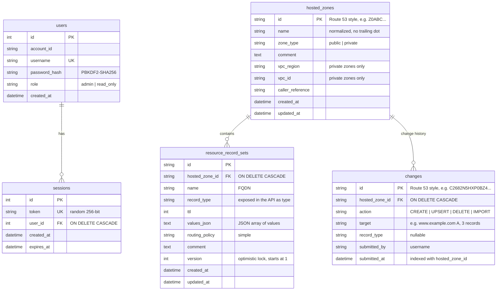

Design notes
- **Column vs. API names.** The record type is stored in the `record_type` column (avoiding the generic `type`), and the API exposes it as `type` in requests and responses, e.g. `{"name":"www","type":"A","ttl":300,"values":["192.0.2.1"]}`.
- **Record sets, not single records.** Route 53 groups all values for a (name, type) pair into one *resource record set* (e.g. an A record with three IPs). The table mirrors that: one row per (zone, name, type), values stored as a JSON array. A `UNIQUE(hosted_zone_id, name, record_type)` constraint enforces it. Value search uses SQLite's `json_each`, so each value is matched as plain text rather than its JSON encoding.
- **Referential integrity.** `PRAGMA foreign_keys=ON` is set on every connection; deleting a zone cascades to its records and its change history.
- **Change history.** Every record create, update, delete, bulk delete and zone-file import writes one `changes` row in the *same transaction* as the data change, so history can never disagree with the data. Status is derived, not stored: `PENDING` until `PROPAGATION_SECONDS` have passed since `submitted_at`, then `INSYNC`. Seed data and no-op requests (e.g. a bulk delete that deletes nothing) record no change. An index on `(hosted_zone_id, submitted_at)` serves the newest-first history query.
- **Default records.** Each zone's apex NS and SOA rows are created with the zone and flagged `is_default` in responses; the service layer prevents deleting or retyping them.
- **Optimistic locking.** `resource_record_sets.version` starts at 1 and is bumped on every update (SQLAlchemy `version_id_col`, which also adds `WHERE version = …` to the UPDATE). The edit page sends `expected_version`; a mismatch, or a write that lands between read and commit, returns `409 ConcurrentModification`. Requests without `expected_version` still work.
- **Migrations.** `create_all` adds new tables; columns added later (`resource_record_sets.version`, `users.role`) are applied to existing database files by an idempotent startup migration in `seed.py` (`PRAGMA table_info` + `ALTER TABLE … ADD COLUMN`).
- **IDs** look like Route 53's (`Z` + 20 chars for zones) and are what appear in URLs.
- **Initialization.** `init_db()` runs on API startup: `create_all` builds tables, ensures the demo user exists, and seeds sample zones only if the zones table is empty — restarts never overwrite user data. `python -m app.seed --reset` rebuilds from scratch.

---

## API overview

Interactive docs: **`http://localhost:8000/docs`** (Swagger UI) and `/redoc`.

All endpoints except `/api/auth/login` and `/api/health` need `Authorization: Bearer <token>`.

| Method | Path | Description |
|---|---|---|
| POST | `/api/auth/login` | Sign in → `{token, expires_at, user}` |
| GET | `/api/auth/session` | Current session (used to restore login on refresh) |
| POST | `/api/auth/logout` | Delete the session |
| GET | `/api/hosted-zones?search=&type=&page=&page_size=` | List zones (paginated) |
| POST | `/api/hosted-zones` | Create zone (+ default NS/SOA) |
| GET | `/api/hosted-zones/{zone_id}` | Get zone |
| PUT | `/api/hosted-zones/{zone_id}` | Update the description `{comment}`, the only mutable field, as in Route 53. Sending `name`, `type`, `vpc_id` or `vpc_region` returns `422 InvalidInput` ("Only the description of a hosted zone can be changed.") |
| DELETE | `/api/hosted-zones/{zone_id}` | Delete (400 `HostedZoneNotEmpty` if it has records) |
| GET | `/api/hosted-zones/{zone_id}/export?format=bind\|json` | Export zone |
| POST | `/api/hosted-zones/{zone_id}/test-record` | Simulated DNS answer `{record_name, type}` → `{response_code, answers, authority, notes}` |
| GET | `/api/hosted-zones/{zone_id}/records?search=&type=A,MX&page=&page_size=` | List records |
| POST | `/api/hosted-zones/{zone_id}/records` | Create record → record + `change` `{id, status, submitted_at}` |
| GET | `/api/hosted-zones/{zone_id}/records/{record_id}` | Get record |
| PUT | `/api/hosted-zones/{zone_id}/records/{record_id}` | Update record; optional `expected_version` → `409 ConcurrentModification` if stale |
| DELETE | `/api/hosted-zones/{zone_id}/records/{record_id}` | Delete record → `200 {change}` |
| POST | `/api/hosted-zones/{zone_id}/records/batch` | Create several records atomically `{records: [...]}` → `{records, change}` |
| POST | `/api/hosted-zones/{zone_id}/records/bulk-delete` | Delete many `{record_ids: [...]}` → `{deleted, skipped, change}` |
| POST | `/api/hosted-zones/{zone_id}/records/import` | Import BIND zone file `{zone_file}` → `{created, skipped, errors, change}` |
| GET | `/api/hosted-zones/{zone_id}/changes?page=&page_size=` | Change history, newest first (paginated) |
| GET | `/api/changes/{change_id}` | Change status, like Route 53 GetChange (404 `NoSuchChange`) |
| GET | `/api/health` | Health check |

Paginated responses: `{ items, total, page, page_size, total_pages }`.

Errors always look like `{ "code": "...", "message": "..." }`, using Route 53 error names where they exist:

| Status | Codes |
|---|---|
| 400 | `InvalidChangeBatch` (bad record value / rule violation), `HostedZoneNotEmpty` |
| 401 | `InvalidCredentials`, `Unauthenticated` |
| 403 | `AccessDenied` (read-only IAM user on a write endpoint) |
| 404 | `NoSuchHostedZone`, `NoSuchRecord`, `NoSuchChange` |
| 409 | `ConflictingDomainExists`, `RecordAlreadyExists`, `CNAMEConflict`, `ConcurrentModification` |
| 422 | `InvalidInput` (schema validation; includes an `errors` list) |
| 500 | `InternalError` (details logged server-side only) |

Example:
```bash
TOKEN=$(curl -s -X POST localhost:8000/api/auth/login -H 'Content-Type: application/json' \
  -d '{"account_id":"123456789012","username":"demo","password":"demo1234"}' | jq -r .token)

ZONE=$(curl -s -X POST localhost:8000/api/hosted-zones -H "Authorization: Bearer $TOKEN" \
  -H 'Content-Type: application/json' -d '{"name":"example.net","comment":"test"}' | jq -r .id)

# Create a record: the record type is sent as "type"
curl -s -X POST localhost:8000/api/hosted-zones/$ZONE/records -H "Authorization: Bearer $TOKEN" \
  -H 'Content-Type: application/json' -d '{"name":"www","type":"A","ttl":300,"values":["192.0.2.1"]}'
```

---

## Setup

Prerequisites: **Python 3.11+** (verified on 3.14; Render uses 3.12), **Node.js 18.18+** (20+ recommended).

### Backend
```bash
cd backend
python -m venv .venv
source .venv/bin/activate            # Windows: .venv\Scripts\activate
pip install -r requirements.txt
uvicorn app.main:app --reload --port 8000
```
API at http://localhost:8000 · docs at http://localhost:8000/docs

### Database
Nothing to do: on first start the API creates `backend/route53.db`, the demo user and six sample hosted zones (example.com, example.org, mycompany.com, shop-demo.net, a reverse-DNS zone and a private zone) with realistic records.

```bash
python -m app.seed --reset    # wipe and re-seed
```

### Frontend
```bash
cd frontend
cp .env.example .env.local           # NEXT_PUBLIC_API_URL=http://localhost:8000
npm install
npm run dev                          # http://localhost:3000
```
Production build: `npm run build && npm start`.

### Tests
```bash
# Backend: 100 API tests (auth, IAM roles, CRUD, every record type, validation, conflicts, batches, search, pagination,
#          zone-file import (TTL units, directives), import/export, Test record resolution rules, optimistic locking + migration, change history)
cd backend && pip install -r requirements-dev.txt && pytest -q

# End-to-end browser test (66 checks across the whole UI). Needs both servers running on a fresh DB.
cd e2e && npm install && npx playwright install chromium && npm test
```

**CI.** GitHub Actions ([`.github/workflows/ci.yml`](.github/workflows/ci.yml)) runs on every push to `main` and every pull request: backend tests; frontend typecheck, lint and production build; then the end-to-end suite against a freshly seeded API and the production frontend (screenshots and server logs are uploaded if it fails).

---

## Environment variables

**Backend** (`backend/.env.example`; all optional)

| Variable | Default | Purpose |
|---|---|---|
| `DATABASE_URL` | `sqlite:///./route53.db` | SQLAlchemy URL |
| `CORS_ORIGINS` | `http://localhost:3000,http://127.0.0.1:3000` | Comma-separated allowed origins |
| `CORS_ORIGIN_REGEX` | – | Regex for allowed origins, e.g. `https://.*\.vercel\.app` |
| `SESSION_TTL_HOURS` | `168` | Session lifetime |
| `DEMO_ACCOUNT_ID` / `DEMO_USERNAME` / `DEMO_PASSWORD` | `123456789012` / `demo` / `demo1234` | Mock administrator sign-in |
| `VIEWER_PASSWORD` | `viewer1234` | Password of the read-only user `viewer` |
| `PROPAGATION_SECONDS` | `10` | How long a record change stays `PENDING` before it reports `INSYNC` |
| `SEED_DEMO_DATA` | `true` | Seed sample zones into an empty DB |

**Frontend** (`frontend/.env.example`)

| Variable | Default | Purpose |
|---|---|---|
| `NEXT_PUBLIC_API_URL` | `http://localhost:8000` | Base URL of the API |

---

## Deployment

The hosted demo runs the API on **Render** and the frontend on **Vercel**.

1. **Backend → Render.** Dashboard → *New* → *Blueprint* → pick this repo. `render.yaml` creates a Python web service from `backend/` (`uvicorn app.main:app --host 0.0.0.0 --port $PORT`, health check `/api/health`). Copy the service URL, e.g. `https://route53-clone-api.onrender.com`.
2. **Frontend → Vercel.** *Add New Project* → import the repo → **Root Directory: `frontend`** → env var `NEXT_PUBLIC_API_URL=<Render URL>` → Deploy.
3. **CORS.** The blueprint already allows `https://*.vercel.app` via `CORS_ORIGIN_REGEX`. For a custom domain, add it to `CORS_ORIGINS` on Render.

### Hosting notes

- **Cold start.** Render's free tier stops the API after a period of inactivity; the first request afterwards can take ~50 s while it starts. The UI accounts for this: the sign-in page pings `/api/health` as soon as it loads so the server starts waking while you type, shows *"Starting the demo server…"* if sign-in takes longer than 4 s, and API calls time out after 70 s with a clear error and a **Retry** action. Opening a console page directly shows the same note while the session is restored.
- **Ephemeral disk.** The free instance's disk is not persistent, so the SQLite database is recreated and re-seeded with the demo data whenever the service restarts or redeploys; changes made on the live demo don't survive that. For durable data, attach a Render persistent disk and point `DATABASE_URL` at it (e.g. `sqlite:////var/data/route53.db`).

---

## Key decisions

- **Cloudscape for the UI.** It is the design system behind the AWS console, so visual fidelity comes from the same components rather than hand-copied CSS.
- **Router → service → model layering.** Routers stay thin; all Route 53 rules live in services, so they are testable and reused by seeding and import.
- **Server-side search, filtering and pagination** — the browser never downloads whole tables.
- **Mock auth that behaves like real auth.** Hashed password, random opaque tokens in a sessions table with expiry, server-side logout. Swapping in Cognito/IAM Identity Center would only replace `auth_service` and the login page.
- **Deliberate auth simplifications.** The session token is kept in `localStorage` as a simplification for mocked auth; a production deployment would use an httpOnly, Secure, SameSite cookie instead, so scripts can't read the token. Login isn't rate-limited because authentication is mocked; production would add rate limiting and account lockout on repeated failures.
- **Validation in two places.** Client checks give instant feedback; Pydantic + the service layer are authoritative.
- **Not implemented on purpose:** real DNS serving, alias records, non-simple routing policies, health checks, DNSSEC, tags (shown as placeholders).

## Requirement checklist

| Requirement | Status | Where |
|---|---|---|
| Mocked login / logout / session persistence | ✅ | `app/login`, `AuthProvider`, `routers/auth.py` |
| Hosted zone view / search / create / edit / delete | ✅ | `app/(console)/hosted-zones`, `services/zone_service.py` |
| DNS record view / search / create / edit / delete | ✅ | `components/records`, `services/record_service.py` |
| A, AAAA, CNAME, TXT, MX, NS, PTR, SRV, CAA | ✅ | `services/validators.py` |
| SQLite persistence | ✅ | `database.py`, `models/` |
| Navigation, tables, forms, search, filters, pagination, modals, notifications | ✅ | Cloudscape components throughout |
| Mocked sections (Dashboard, Traffic policies, Health checks, Resolver, Profiles) | ✅ | `app/(console)/[...section]` |
| Bonus: BIND import, JSON/BIND export, dark mode, shortcuts, bulk ops | ✅ | see Features |
| Extra: Test record (DNS response simulator) | ✅ | `services/dns_test_service.py`, `hosted-zones/[zoneId]/test-record` |
| Extra: safe concurrent edits (optimistic locking) | ✅ | `version` column, `RecordFormPage` |
| Extra: filters and pagination in the URL | ✅ | `hooks/useServerCollection.ts` |
| Extra: change status (PENDING → INSYNC) and change history | ✅ | `services/change_service.py`, `ChangeHistory`, `NotificationsProvider` |
| Extra: read-only IAM user, account menu, hosted zone ARN | ✅ | `routers/deps.py` (`require_write`), `hooks/useWriteAccess.ts`, `TopNav` |
| README: setup, architecture, schema, API | ✅ | this file |
